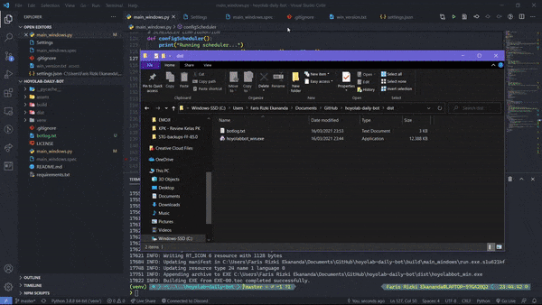

# Genshin Hoyolab Daily Check-in Bot 📜🖋
Genshin Impact's Hoyolab Daily Check-in Bot is here! The concept is simple, **run once, run forever**. You only need to run it once, then it will continue to run forever (except if you uninstall it ofc tehe)



> #### Disclaimer: Only works on Windows (Linux & Mac version coming soon!)

# Features 🃏
- **Run once, run forever**✨ The program will configure itself to run daily according to your localtime's reward claiming time. It will also autorun if your laptop/computer is in sleep mode, and will still run the next time your computer is on if you skipped the server refresh time.
- If there's no connection, it will wait for a minute. No maximum retry.

# Prerequisites 🎯
- Windows OS
- Have login to mihoyo's website at any browser (A login for a year is enough)

# How to use ✨
1. [Download the newest release (.zip)](https://github.com/darkGrimoire/hoyolab-daily-bot/releases/latest) and extract
2. Run program and click Yes when prompted. The program needs to be run as administrator to enable scheduling
3. You can see what's the bot doing from `botlog.txt`.

# Configuration File (v1.1.5+)
- **BROWSER**: You can target specific browser to be used for login. Please beware that this program doesn't support account chooser yet, so if you have multiple account you may use a browser you rarely use that only contains 1 account information.  
Currently supported browsers are: `firefox`, `chrome`, `chromium`, `opera`, and `edge`. The default is `all`.
- **SERVER_UTC**: Server UTC in each server is different. You can check your UTC in [Your Hoyolab Daily Check-in page.](https://webstatic-sea.mihoyo.com/ys/event/signin-sea/index.html?act_id=e202102251931481&lang=en-us) The default for Asia server is +8 UTC.
- **DELAY_MINUTE**: Sometimes, your PC is some minutes earlier than the server time. If you're experiencing reward already claimed whenever the bot started, please add some delay.
- **RANDOMIZER**: Turn on (`true`) or off (`false`) for randomizing bot scheduler. Default is `false`
- **RANDOM_RANGE**: Range in seconds for randomizing bot scheduler. Default is `3600` (means the bot will starts delayed randomly within 1 hour after daily reset).
- **SCHEDULER_NAME**: The name of the bot scheduler. With this, you can have multiple bot scheduled with different configurations. For example, in one folder the bot is configured to login from chrome, while the other one is configured to login from firefox. The default is "HoyolabCheckInBot".
- **ACT_ID** and **DOMAIN_NAME** doesn't need changing. It's only there for futureproof reasons.

# How to update 📈
Just overwrite the executable file haha

# Development Setup
1. Setup virtualenv
   ```
   pip install virtualenv
   python -m venv env
   env\Scripts\activate
   ```
2. Install dependencies
   ```
   pip install -r requirements.txt
   ```
3. Run `python main_windows.py` or `run.bat` as administrator if you want to run the scheduling, or if not use `python main_windows.py -R` or `run.bat -R`.

Feel free to open up issues for feature request, bugs, etc. or contribute.
